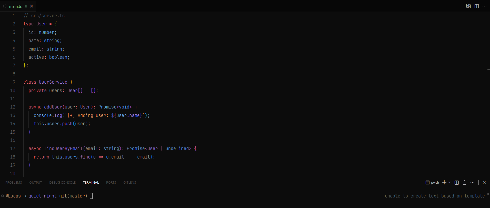

# Quiet Night

  
   
  

Quiet Night is a calm and introspective dark theme for Visual Studio Code, inspired by the stillness and atmosphere of the midnight city.  
It’s designed for focus and clarity, offering a soft balance between contrast and comfort for long coding sessions.

---

## Features

- Deep, distraction-free dark background for full immersion  
- Subtle highlights and accents that guide focus without strain  
- Minimal, balanced contrast for long hours of comfortable coding  
- Inspired by the aesthetics of modern urban nights  
- Built for developers who value calm, focus, and design simplicity

---

## Ideal For

- Late-night coders who enjoy quiet, minimal environments  
- Developers who prefer subdued lighting and consistent contrast  
- Users who want a dark theme that feels professional and modern  

---

## About

Created by **Lucas Silva**, Quiet Night reflects the calm and rhythm of the city after dark.  
A theme designed for those who find focus in silence and beauty in simplicity.

---

**Enjoy the night. Code in peace.** 🌙  